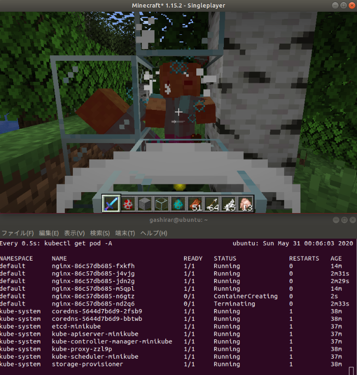
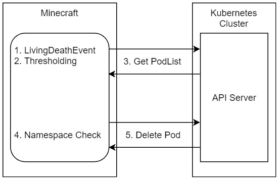

# KubeChaosCraft Mod

Kubernetes + Chaos Engineering + Minecraft = KubeChaosCraft!  
Gamified Chaos Engineering tool for Kubernetes.

Inspired by KubeInvaders.  
https://github.com/lucky-sideburn/KubeInvaders

## Description

KubeChaosCraft is Minecraft Mod.

See [Demo](https://github.com/gashirar/KubeChaosCraftMod/blob/master/doc/demo.gif)

Using the event that the player defeated the Mob, it sends a request to the Kubernetes API Server to remove the Pod.

## Installations

### Minecraft and Minecraft Forge

Sorry! Please do your own.

Forge Version is v1.15.2!

### KubeChaosCraftMod

Put the `release/kubechaoscraftmod-x.x.jar` file in the mod directory.

### Kubernetes

Start a Kubernetes cluster with v1.16.

I recommend Minikube.

`minikube start --kubernetes-version=v1.16.0`

## Configurations

### KubeChaosCraftMod Configuration
| var              | description                                                  | default value |
| ---------------- | ------------------------------------------------------------ | ------------- |
| threshold        | The threshold to delete the Pod. If set to 0.5, there is a 50% chance that the Pod will be removed every time a Mob is killed by a player. | 0.0           |
| targetNamespaces | List of the target namespace.                                | []            |

### Kubernetes Configuration
This Mod uses Config.defaultClient() to obtain the cluster information. So make sure you have a Kubernetes configuration on the environment where you are running Minecraft.

## Use cases

Adopting chaos engineering strategies for your production environment is really useful, because it is the only way to test if a system supports unexpected destructive events.

~~KubeInvaders~~ KubeChaosCraft is a game — so please do not take it too seriously! — but it demonstrates some important use cases:

- Test how resilient Kubernetes clusters are on unexpected pod deletion
- Collect metrics like pod restart time
- Tune readiness probes

https://kubernetes.io/blog/2020/01/22/kubeinvaders-gamified-chaos-engineering-tool-for-kubernetes/

## All credits for Forge, FML etc go to their respective owners.

Any code written by me is free for any use at all.